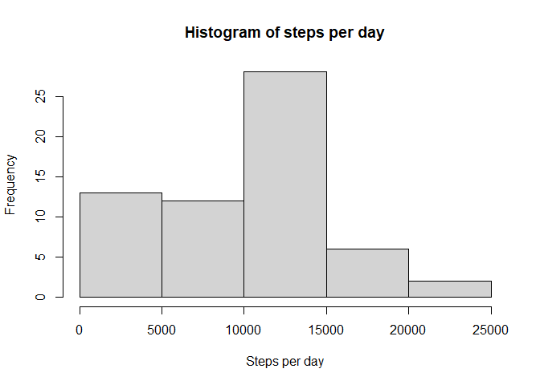
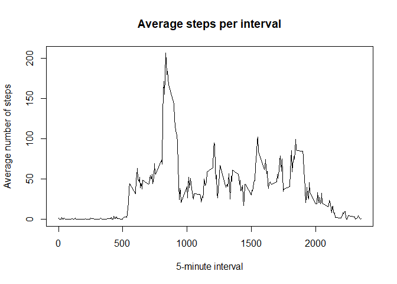
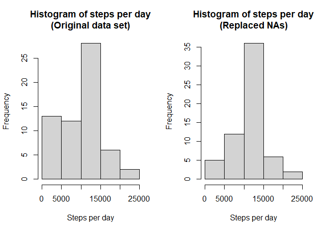
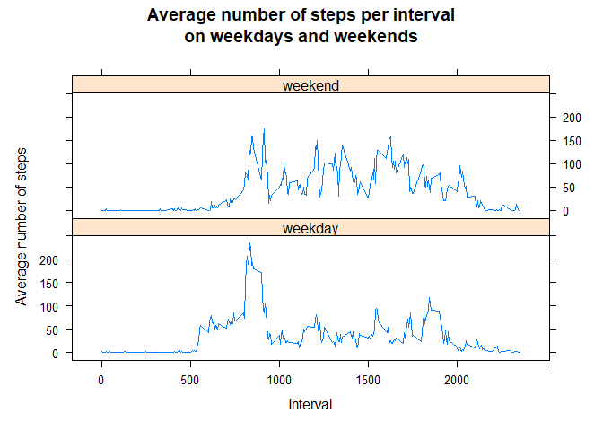

## Loading and preprocessing the data

#### 1. Load the data (i.e. read.csv())


```r
library("dplyr")
library("lubridate")
library("lattice")
activity <- read.csv(unz("activity.zip", "activity.csv"))
```

#### 2. Process/transform the data (if necessary) into a format suitable for your analysis


```r
activity$date <- ymd(activity$date)
```

#### (from last question) 1. Create a new factor variable in the dataset with two levels -- "weekday" and "weekend" indicating whether a given date is a weekday or weekend day.


```r
# I decided to create the factor variable at the beginning because it counts as "processing the data". 
# It also helps visualizing the entire data set from the beginning.
activity$day_or_end <- sapply(activity$date,
                              function(x) {
                                              if(wday(x, week_start = 1) == 6 |
                                                 wday(x, week_start = 1) == 7)
                                              {"weekend"} else {"weekday"}
                                          }
                              )
```

Quick visualization of the data, so everybody gets used to it and understands the following code easier:


```r
head(activity)
```

```
##   steps       date interval day_or_end
## 1    NA 2012-10-01        0    weekday
## 2    NA 2012-10-01        5    weekday
## 3    NA 2012-10-01       10    weekday
## 4    NA 2012-10-01       15    weekday
## 5    NA 2012-10-01       20    weekday
## 6    NA 2012-10-01       25    weekday
```


```r
summary(activity)
```

```
##      steps             date               interval       day_or_end       
##  Min.   :  0.00   Min.   :2012-10-01   Min.   :   0.0   Length:17568      
##  1st Qu.:  0.00   1st Qu.:2012-10-16   1st Qu.: 588.8   Class :character  
##  Median :  0.00   Median :2012-10-31   Median :1177.5   Mode  :character  
##  Mean   : 37.38   Mean   :2012-10-31   Mean   :1177.5                     
##  3rd Qu.: 12.00   3rd Qu.:2012-11-15   3rd Qu.:1766.2                     
##  Max.   :806.00   Max.   :2012-11-30   Max.   :2355.0                     
##  NA's   :2304
```


```r
str(activity)
```

```
## 'data.frame':	17568 obs. of  4 variables:
##  $ steps     : int  NA NA NA NA NA NA NA NA NA NA ...
##  $ date      : Date, format: "2012-10-01" "2012-10-01" ...
##  $ interval  : int  0 5 10 15 20 25 30 35 40 45 ...
##  $ day_or_end: chr  "weekday" "weekday" "weekday" "weekday" ...
```


## What is mean total number of steps taken per day?

#### 1. Make a histogram of the total number of steps taken each day


```r
steps_per_day <- activity %>% group_by(date) %>% 
                 summarize(total_steps = sum(steps, na.rm = TRUE))
hist(steps_per_day$total_steps, 
     xlab = "Steps per day", 
     main = "Histogram of steps per day")
```

<!-- -->

#### 2. Calculate and report the mean and median total number of steps taken per day


```r
mean(steps_per_day$total_steps)
```

```
## [1] 9354.23
```

```r
median(steps_per_day$total_steps)
```

```
## [1] 10395
```

## What is the average daily activity pattern?

#### 1. Make a time series plot (i.e. type = "l") of the 5-minute interval (x-axis) and the average number of steps taken, averaged across all days (y-axis)


```r
steps_per_interval <- activity %>% group_by(interval) %>% 
        summarize(mean_steps = mean(steps, na.rm = TRUE))
plot(steps_per_interval$mean_steps ~ steps_per_interval$interval, 
     type = "l", 
     xlab = "5-minute interval", 
     ylab = "Average number of steps", 
     main = "Average steps per interval")
```

<!-- -->

#### 2. Which 5-minute interval, on average across all the days in the dataset, contains the maximum number of steps?


```r
as.numeric(steps_per_interval[which.max(steps_per_interval$mean_steps), 1])
```

```
## [1] 835
```

The interval between 8:35 and 8:40 contains the maximum number of steps.

## Imputing missing values

#### 1. Calculate and report the total number of missing values in the dataset (i.e. the total number of rows with `NA`s)


```r
sum(!complete.cases(activity))
```

```
## [1] 2304
```

#### 2. Devise a strategy for filling in all of the missing values in the dataset. The strategy does not need to be sophisticated. For example, you could use the mean/median for that day, or the mean for that 5-minute interval, etc.

My strategy is to replace NAs of each 5-minute interval with their respective means

#### 3. Create a new dataset that is equal to the original dataset but with the missing data filled in.


```r
activity2 <- left_join(activity, steps_per_interval, "interval")

activity2$steps2 <- sapply(1:length(activity2$steps), function(x) {
        if(is.na(activity2[x,1])) {activity2[x,5]} else {activity2[x,1]}
})
```


#### 4. Make a histogram of the total number of steps taken each day and Calculate and report the **mean** and **median** total number of steps taken per day. Do these values differ from the estimates from the first part of the assignment? What is the impact of imputing missing data on the estimates of the total daily number of steps?


```r
steps_per_day2 <- activity2 %>% group_by(date) %>% 
                 summarize(total_steps = sum(steps2, na.rm = TRUE))

par(mfrow = c(1,2))
hist(steps_per_day$total_steps, 
     xlab = "Steps per day", 
     main = "Histogram of steps per day\n(Original data set)")
hist(steps_per_day2$total_steps, 
     xlab = "Steps per day", 
     main = "Histogram of steps per day\n(Replaced NAs)")
```

<!-- -->

```r
mean(steps_per_day$total_steps)
```

```
## [1] 9354.23
```

```r
median(steps_per_day$total_steps)
```

```
## [1] 10395
```

```r
mean(steps_per_day2$total_steps)
```

```
## [1] 10766.19
```

```r
median(steps_per_day2$total_steps)
```

```
## [1] 10766.19
```

By replacing NAs, the histogram of steps per day more closely resembles a normal distribution, and both mean and median number of daily steps increased.

Step count from original dataset:

```r
mean(steps_per_day$total_steps)
```

```
## [1] 9354.23
```

```r
median(steps_per_day$total_steps)
```

```
## [1] 10395
```

Step count from dataset with replaced NAs: 

```r
mean(steps_per_day2$total_steps)
```

```
## [1] 10766.19
```

```r
median(steps_per_day2$total_steps)
```

```
## [1] 10766.19
```

After replacing NAs, both mean and median number of daily steps increased.


## Are there differences in activity patterns between weekdays and weekends?

#### 2. Make a panel plot containing a time series plot (i.e. `type = "l"`) of the 5-minute interval (x-axis) and the average number of steps taken, averaged across all weekday days or weekend days (y-axis). The plot should look something like the following, which was created using **simulated data**:


```r
steps_per_interval2 <- activity2 %>% group_by(day_or_end, interval) %>% summarize(mean_steps = mean(steps, na.rm = TRUE))
```

```
## `summarise()` has grouped output by 'day_or_end'. You can override using the
## `.groups` argument.
```

```r
xyplot(steps_per_interval2$mean_steps ~ steps_per_interval2$interval | steps_per_interval2$day_or_end, type = "l", layout = 1:2, xlab = "Interval", ylab = "Average number of steps", main = "Average number of steps per interval\non weekdays and weekends")
```

<!-- -->


